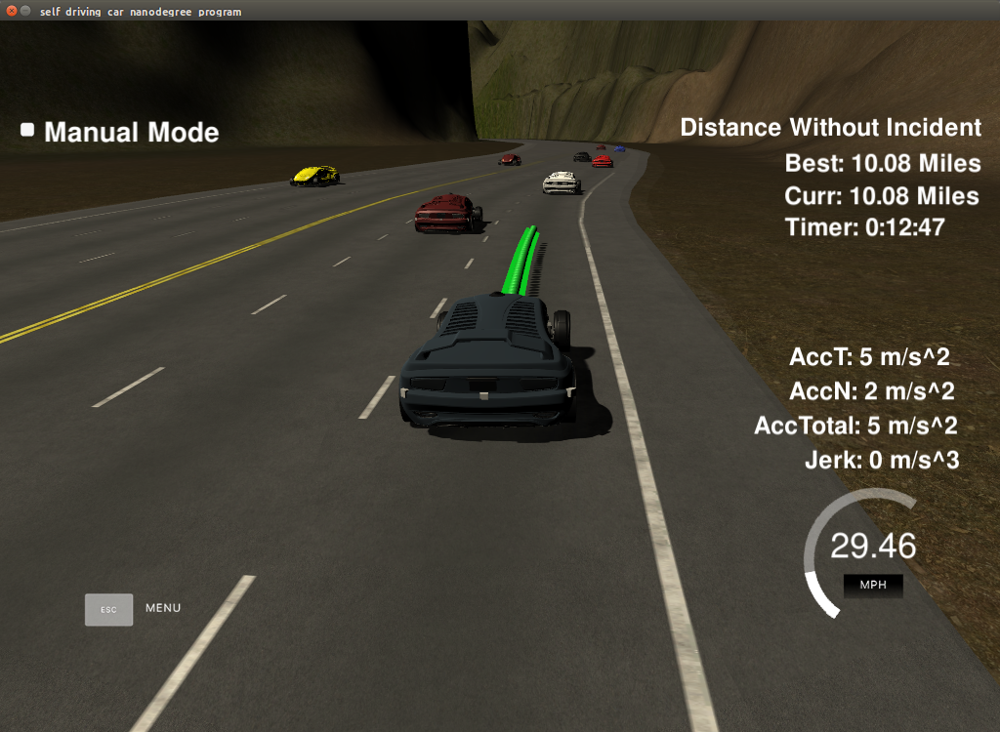

# CarND-Path-Planning-Project
Self-Driving Car Engineer Nanodegree Program
   
### Simulator.
You can download the Term3 Simulator which contains the Path Planning Project from the [releases tab (https://github.com/udacity/self-driving-car-sim/releases).

### Goals
In this project your goal is to safely navigate around a virtual highway with other traffic that is driving +-10 MPH of the 50 MPH speed limit. You will be provided the car's localization and sensor fusion data, there is also a sparse map list of waypoints around the highway. The car should try to go as close as possible to the 50 MPH speed limit, which means passing slower traffic when possible, note that other cars will try to change lanes too. The car should avoid hitting other cars at all cost as well as driving inside of the marked road lanes at all times, unless going from one lane to another. The car should be able to make one complete loop around the 6946m highway. Since the car is trying to go 50 MPH, it should take a little over 5 minutes to complete 1 loop. Also the car should not experience total acceleration over 10 m/s^2 and jerk that is greater than 10 m/s^3.

#### The map of the highway is in data/highway_map.txt
Each waypoint in the list contains  [x,y,s,dx,dy] values. x and y are the waypoint's map coordinate position, the s value is the distance along the road to get to that waypoint in meters, the dx and dy values define the unit normal vector pointing outward of the highway loop.

The highway's waypoints loop around so the frenet s value, distance along the road, goes from 0 to 6945.554.

### Approach
While working on this project, I referred to the approach discussed in the Q&A section. I used spline library to interpolate 50 paths points in future. I used previous cycle remaining path points to ensure continuity. 

For Behaviour, I started this project with hardcoded heurestics to dentiy right lane change and acceleration conditions. At the begining, I thought it would be hard to implement such an algorithm.
But the implementation turned out to be relatively much simpler, partly because the limited number of states to consider. I refined my heurestics to identify safer lane changes. For example, if both left and right lane is free, the car would choose the lane which has maximum opening between the car and car ahead. This would help with lesser number of lane changes and potentially higher average speed. 

For a distance of 10.08 miles, the car took 12:47 minutes giving an average speed of 47 miles per hour.

As future extension of this work, I would like to add cost based Behaviour planning instead of hardcoded heurestics. 

### References
I used code samples from Q&A and from other udacity presubmissions. 

# [Rubic](https://review.udacity.com/#!/rubrics/1020/view) points

## Compilation

### The code compiles correctly.

I added [src/spline.h](./scr/spline.h). This single file spline library helps in interpolating paths smoothly. This did not require any change in cmake configurations. The code compiles successfully. 

## Valid trajectories

### The car is able to drive at least 4.32 miles without incident.
There was no incidence idetified on a run on more than 10 miles. 

### The car drives according to the speed limit.
During the run, the car never went over the speed limit of 50. 

### Max Acceleration and Jerk are not Exceeded.
During the run, the car never went over the allowed acceleration and Jerk. In fact, the acceleration and jerk were always less than 5 m/s^2 and 5 m/s^3 respectivelly.

### Car does not have collisions.
During the run, the car dd not have any collision.

### The car stays in its lane, except for the time between changing lanes.
The car stayed in middle lane. After taking over cars, it came back to middle lane as soon it was safe to do so. 

### The car is able to change lanes
The car was able to determine safe lane changes and executed the lane changes. 
